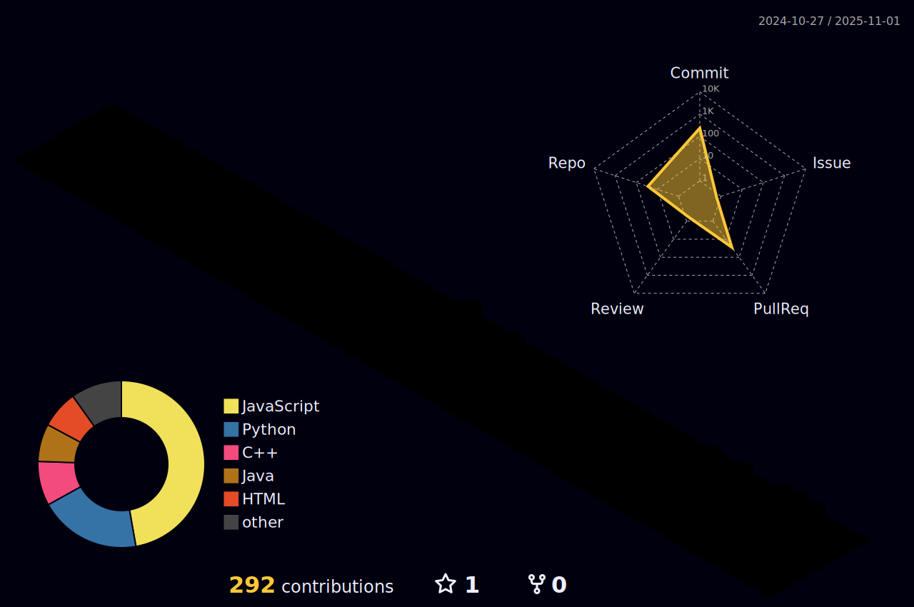

# Olá, me chamo Vinícius! #

  
  
  

## Pode me chamar de Vini e seja bem vindo ao meu perfil GitHub 👋 ##

* Tenho 18 anos;
* Cursando Engenharia de Software na FIAP;
* São Paulo/SP.

## Tecnologias ##

##

